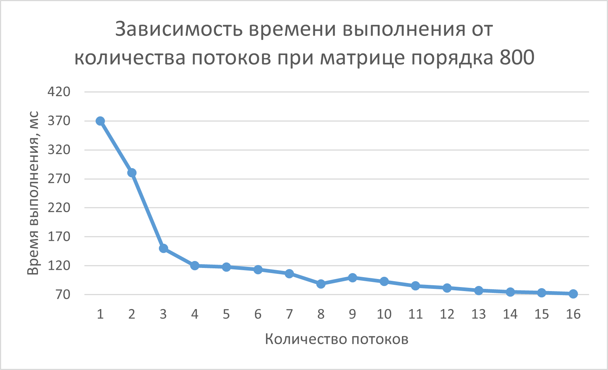
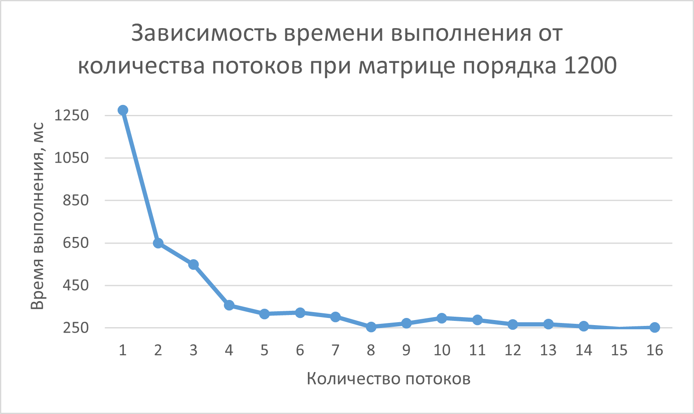
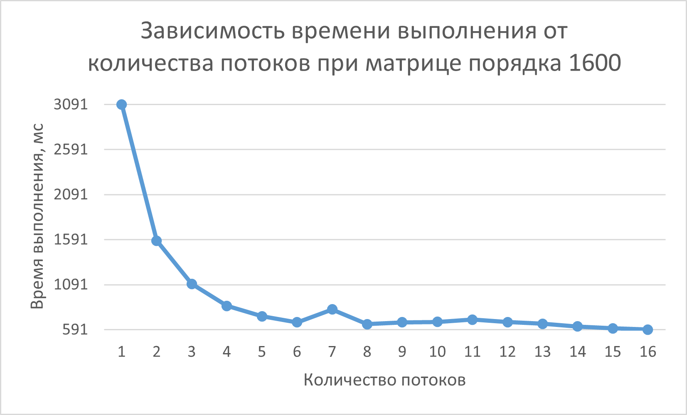
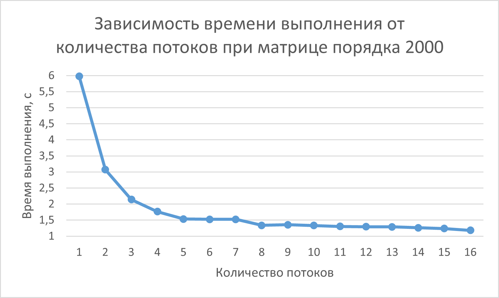
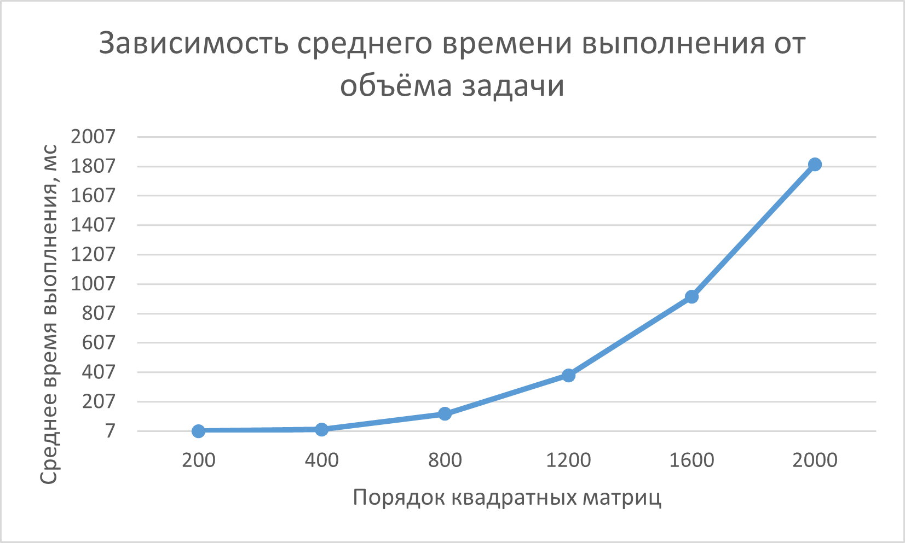

# parallel-programming
# Отчёт по лабораторной работе: Перемножение матриц на C++ с использованием технологии OpenMP

## 1. Задание
Модифицировать программу из л/р №1 для параллельной работы по технологии OpenMP.
Провести серию экспериментов с разным количеством потоков (1, 2, 4, 8 и т.д.),
разными размерами матриц (примерно 200, 400, 800, 1200, 1600, 2000),
с разным количеством вычислительных ядер при наличии технической возможности (1, 2, 4, 8 и т.д. ),
иначе использовать фиксированное существующее количество вычислительных ядер, например 4.

## 2. Описание работы скриптов

### 2.1. `generate_matrices.py`
- Использует `numpy.random.randint` для генерации целочисленных значений.
- Порядок матрицы `n_matrix` задан внутри скрипта (например, `n_matrix = 1000`).
- Записывает `n_matrix` в первую строку текстового файла, затем сгенерированный элементы матрицы построчно.

### 2.2. `verification_matrix.py`
- Загружает матрицы A, B и результат C++ из файлов по фиксированным путям.
- Считывает порядок квадратных матриц `n_matrix` из первой строки каждого файла.
- Вычисляет эталонное произведение через `np.dot` и выполняет точное поэлементное сравнение с результатом C++ с помощью `np.array_equal`.
- При успешном совпадении сохраняет эталонную матрицу в файл `verification_result_C.txt` для возможности визуального анализа и выводит подтверждение в консоль.
- В случае ошибки выводит уведомление и завершает работу.

### 2.2. `matrix_multiplication.cpp`
- Матрицы считываются из текстовых файлов и хранятся в `vector<long long>` как одномерные массивы для повышения локальности данных.
- Доступ к элементу `(i, j)` осуществляется по формуле `i * N + j,` где `N` — порядок квадратной матрицы.
- Параллелизация вычислений реализована с помощью директивы `#pragma omp parallel for`, которая распределяет итерации внешнего цикла по строкам между потоками.
- Оптимизацирован порядок обхода циклов `i -> k -> j`, что обеспечивает последовательный доступ к памяти и эффективную работу кэш-памяти процессора.
- Измерение времени каждой итерации эксперимента (от 1 до 16 потоков) производится с помощью `chrono::high_resolution_clock`.
- Программа обнуляет результирующий вектор `result_matrix` перед каждым новым замером для обеспечения чистоты данных.
- Результаты замеров (время в мс) сохраняются в файл `statistics_data_N.txt`, а итоговая рассчитанная матрица записывается в `result_C.txt`.

## 3. Результаты экспериментов

Для демонстрации работы программы были проведены эксперименты с разным количеством потоков (1, 2, 3, 4, 5, 6, 7, 8, 9, 10, 11, 12, 13, 14, 15, 16)
для матриц порядка 200, 400, 800, 1200, 1600, 2000 с фиксированным количеством вычислительных ядер 8 (в силу имеющейся технической возможности).

### 3.1. При порядке равном 200

- График времени выполнения для матриц порядка 200 имеет зигзагообразный характер - нестабильность.
- На малых объемах данных время выполнения крайне мало: от 5 до 11 мс.
- Основное влияние на график оказывает не вычислительная нагрузка, а «шум» операционной системы и накладные расходы OpenMP на создание и синхронизацию потоков.

### 3.2. При порядке равном 400

- График времени выполнения для матриц порядка 400 имеет колебательный характер с тенденцией к снижению.
- Неравномерное распределение малого количества строк (400) между потоками (например, на 7 или 9 потоках) создает дисбаланс нагрузки, что отражается в локальных скачках времени.

### 3.3. При порядке равном 800

- График времени выполнения для матриц порядка 800 имеет форму нисходящей кривой, напоминающей гиперболу.
- При данном объёме задачи (N=800) алгоритм начинает работать эффективно.
- Наблюдается стабильное падение времени при переходе от 1 к 8 потокам, затем небольшой локальный всплеск из-за неравномерности распредления данных между потоками, и дальше опять падения от 10 до 16 потока.  

### 3.4. При порядке равном 1200

- У графика времени выполнения для матриц порядка 1200 наблюдается стабильное падение времени при переходе от 1 к 5 потокам, затем небольшой локальный всплеск в 6-ти потоках из-за неравномерности распредления данных между потоками, и дальше опять падение до 8-ми потоков, всплекс и снова падение.

### 3.5. При порядке равном 1600

- У графика времени выполнения для матриц порядка 1600 пиковые всплески наблюдаются при 7-ми и 11-ти потоках.

### 3.6. При порядке равном 2000

- При данном большом объёме данных N=2000 один поток занимает почти 6 секунд. Но при росте количества потоков до 8, время падает очень быстро. На 8 потоках задача решается всего за 1.3 секунды (ускорение программы примерно в 4.6 раз), что свидетельсвует об эффективном использовании 8 ядер процессора.
- После 8 потоков время практически перестает уменьшаться (при 16-ти потоков задача выполняется за 1.2 секунды - 5-ти кратное ускорение выполнения программы).

### 3.7. Зависимость времени выполнения от объёма задачи

- Данный график показывает, как растет среднее время выполнения при увеличении порядка матрицы.
- Кривая подтверждает теоретическую сложность алгоритма $O(N^3)$. При увеличении размера матрицы в 2 раза (например, с 800 (время:125.16) до 1600 (время: 919.56)), время работы увеличивается примерно в 8 раз: 919.56 / 125.16 = 7.3

## 4. Выводы

- Распараллеливать маленькие матрицы (типа $N=200$) нет смысла. Программа тратит больше времени на командование потоками, чем на саму работу. Из-за этого на маленьких графиках видны прыжки и зигзаги.
- На больших задачах ($N=2000$) удалось ускорить программу в 5 раз. Это показываетс, что многопоточность жизненно необходима для тяжелых вычислений.
- Графики показали, что самый большой рывок производительности происходит при переходе от 1 к 8 потокам.
- Неровные графики при $N=200$ и $N=400$ доказывают, что операционная система отвлекается на фоновые задачи, но при больших нагрузках программа становится устойчивой к внешним помехам, и график превращается в более ровную линию.