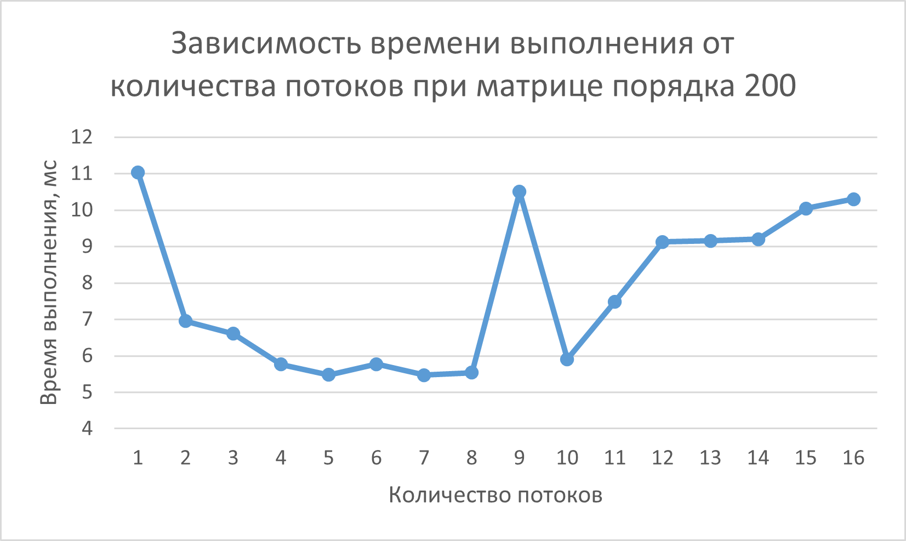
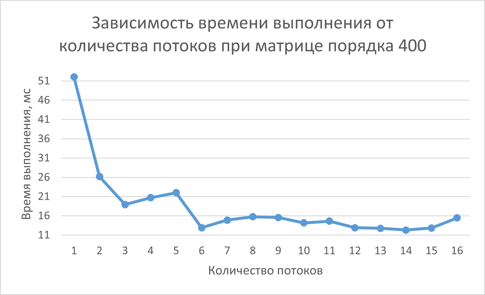

# parallel-programming
# Отчёт по лабораторной работе: Перемножение матриц на C++ с технологии OpenMP

## 1. Задание
Модифицировать программу из л/р №1 для параллельной работы по технологии OpenMP.
Провести серию экспериментов с разным количеством потоков (1, 2, 4, 8 и т.д.),
разными размерами матриц (примерно 200, 400, 800, 1200, 1600, 2000),
с разным количеством вычислительных ядер при наличии технической возможности (1, 2, 4, 8 и т.д. ),
иначе использовать фиксированное существующее количество вычислительных ядер, например 4.

## 2. Описание работы скриптов

### 2.1. `generate_matrices.py`
- Использует `numpy.random.randint` для генерации целочисленных значений.
- Порядок матрицы `n_matrix` задан внутри скрипта (например, `n_matrix = 1000`).
- Записывает `n_matrix` в первую строку текстового файла, затем сгенерированный элементы матрицы построчно.

### 2.2. `verification_matrix.py`
- Загружает матрицы A, B и результат C++ из файлов по фиксированным путям.
- Считывает порядок квадратных матриц `n_matrix` из первой строки каждого файла.
- Вычисляет эталонное произведение через `np.dot` и выполняет точное поэлементное сравнение с результатом C++ с помощью `np.array_equal`.
- При успешном совпадении сохраняет эталонную матрицу в файл `verification_result_C.txt` для возможности визуального анализа и выводит подтверждение в консоль.
- В случае ошибки выводит уведомление и завершает работу.

### 2.2. `matrix_multiplication.cpp`
- Матрицы считываются из текстовых файлов и хранятся в `vector<long long>` как одномерные массивы для повышения локальности данных.
- Доступ к элементу `(i, j)` осуществляется по формуле `i * N + j,` где `N` — порядок квадратной матрицы.
- Параллелизация вычислений реализована с помощью директивы `#pragma omp parallel for`, которая распределяет итерации внешнего цикла по строкам между потоками.
- Оптимизацирован порядок обхода циклов `i -> k -> j`, что обеспечивает последовательный доступ к памяти и эффективную работу кэш-памяти процессора.
- Измерение времени каждой итерации эксперимента (от 1 до 16 потоков) производится с помощью `chrono::high_resolution_clock`.
- Программа обнуляет результирующий вектор `result_matrix` перед каждым новым замером для обеспечения чистоты данных.
- Результаты замеров (время в мс) сохраняются в файл `statistics_data_N.txt`, а итоговая рассчитанная матрица записывается в `result_C.txt`.

## 3. Результаты экспериментов

Для демонстрации работы программы были проведены эксперименты с разным количеством потоков (1, 2, 3, 4, 5, 6, 7, 8, 9, 10, 11, 12, 13, 14, 15, 16)
для матриц порядка 200, 400, 800, 1200, 1600, 2000 с фиксированным количеством вычислительных ядер 8 (в силу имеющейся технической возможности).

### 3.1. При порядке равном 200

- График времени выполнения для матриц порядка 200 имеет зигзагообразный характер - нестабильность.
- На малых объемах данных время выполнения крайне мало: от 5 до 11 мс.
- Основное влияние на график оказывает не вычислительная нагрузка, а «шум» операционной системы и накладные расходы OpenMP на создание и синхронизацию потоков.

- График времени выполнения для матриц порядка 400 имеет колебательный характер с тенденцией к снижению.
- Неравномерное распределение малого количества строк (400) между потоками (например, на 7 или 9 потоках) создает дисбаланс нагрузки, что отражается в локальных скачках времени.
