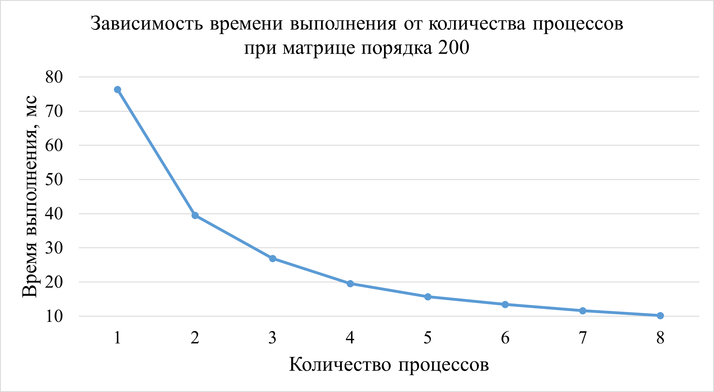
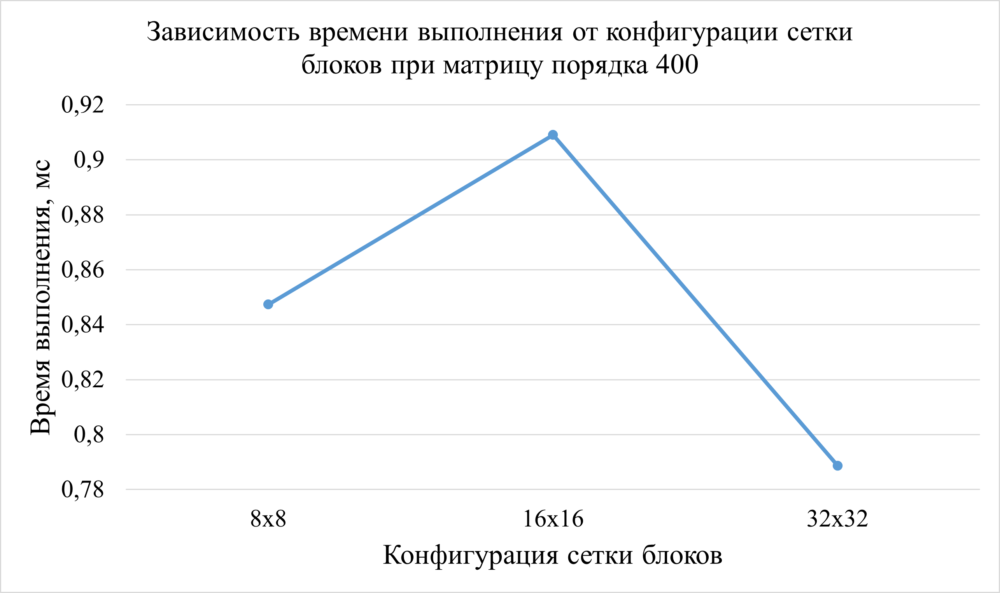
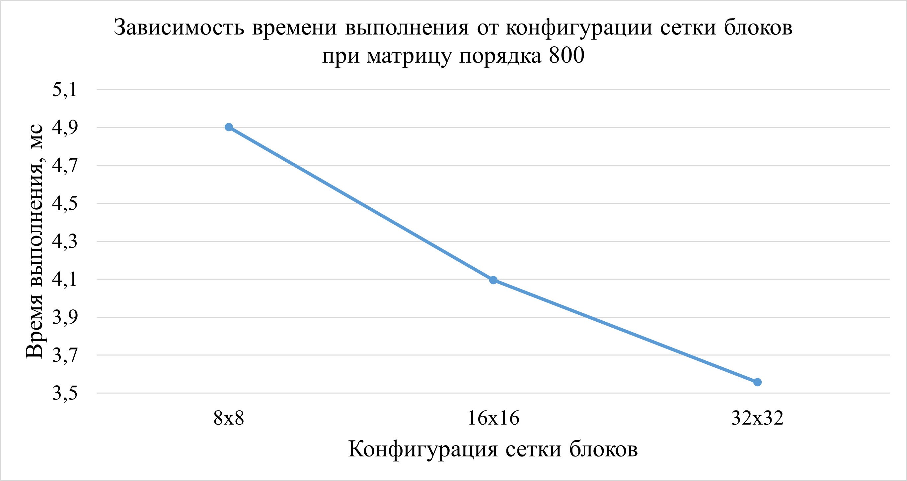
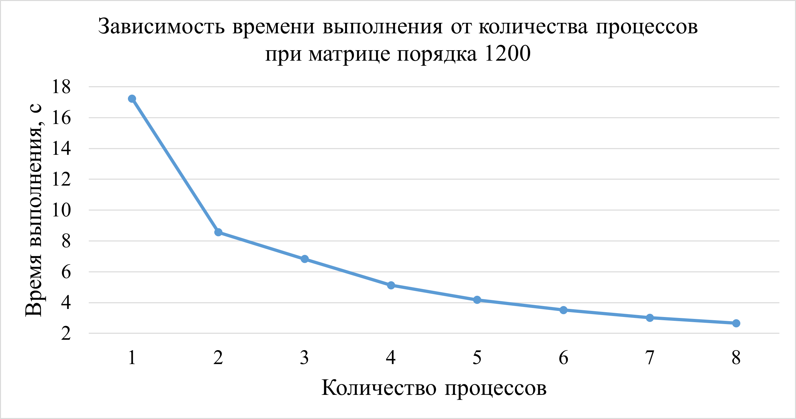
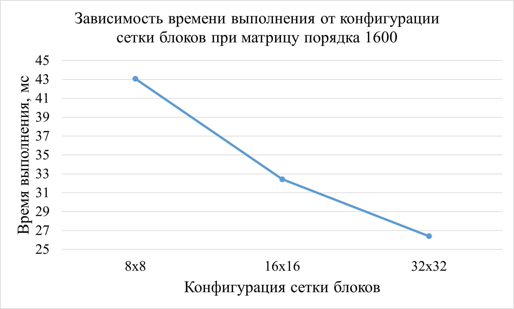
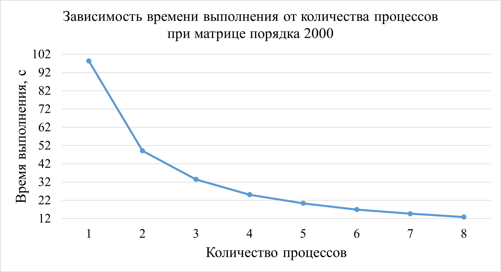

# parallel-programming
# Отчёт по лабораторной работе: Перемножение матриц на C++ с использованием суперкомпьютера «Сергей Королёв»

## 1. Задание

### 1.1 Задание для 5-ой лабораторной работы
Параллельную версию программы на MPI необходимо также запустить на суперкомпьютере «Сергей Королёв».

### 1.2 Задание для 3-ой лабораторной работы
Модифицировать программу из л/р №1 для параллельной работы по технологии MPI.
Провести серию экспериментов с разными размерами матриц (примерно 200, 400, 800, 1200, 1600, 2000),
с разным количеством вычислительных ядер (1, 2, 4, 8 и т.д.).

## 2. Описание работы скриптов

### 2.1. `generate_matrices.py`
- Использует `numpy.random.randint` для генерации целочисленных значений.
- Порядок матрицы `n_matrix` задан внутри скрипта (например, `n_matrix = 1000`).
- Записывает `n_matrix` в первую строку текстового файла, затем сгенерированный элементы матрицы построчно.

### 2.2. `verification_matrix.py`
- Загружает матрицы A, B и результат C++ из файлов по фиксированным путям.
- Считывает порядок квадратных матриц `n_matrix` из первой строки каждого файла.
- Вычисляет эталонное произведение через `np.dot` и выполняет точное поэлементное сравнение с результатом C++ с помощью `np.array_equal`.
- При успешном совпадении сохраняет эталонную матрицу в файл `verification_result_C.txt` для возможности визуального анализа и выводит подтверждение в консоль.
- В случае ошибки выводит уведомление и завершает работу.

### 2.3. `matrix_multiplication.cpp`
- Матрицы считываются из текстовых файлов и хранятся в `vector<long long>` как одномерные массивы для повышения локальности данных.
- Доступ к элементу `(i, j)` осуществляется по формуле `i * N + j,` где `N` — порядок квадратной матрицы.
- Параллелизация вычислений реализована средствами `MPI`: главный процесс (rank 0) распределяет строки матрицы `A` между процессами через `MPI_Scatterv`, рассылает матрицу `B` целиком через `MPI_Bcast` и собирает итоговые части результата через `MPI_Gatherv`.
- Вычисление элементов результирующей матрицы производится по классическому алгоритму с порядком обхода циклов `i -> j -> k`.
- Измерение времени выполнения программы осуществляется с помощью `chrono::high_resolution_clock`.
- Результаты замеров (время в мс) и итоговая рассчитанная матрица записываются в `result_C_<size_mpi>_.txt`, где `size_mpi` - это число процессов.

### 2.4. Код `matrix_multiplication.cpp`

```C++
#include <mpi.h>
#include <iostream>
#include <cstdlib>
#include <vector>
#include <string>
#include <fstream>
#include <chrono>

using namespace std;

vector<long long> read_matrix(const string& filename, size_t& size)
{
    ifstream file(filename);
    if (!file.is_open())
    {
        cerr << "Ошибка: Не удалось открыть файл " << filename << endl;
        exit(1);
    }

    file >> size;

    vector<long long> matrix_value(size * size);
    for (size_t i = 0; i < size * size; ++i)
    {
        if (!(file >> matrix_value[i]))
        {
            cerr << "Ошибка: Недостаточно данных в файле " << filename << " для " << size << "x" << size << " матриц" << endl;
            exit(1);
        }
    }
    return matrix_value;
}

void write_matrix(const string& filename, const vector<long long>& matrix_flat, size_t& size, const chrono::duration<double, milli>& duration)
{
    ofstream file(filename);
    if (!file.is_open())
    {
        cerr << "Ошибка открытия файла:  " << filename << endl;
        exit(1);
    }

    file << size << endl;
    for (size_t i = 0; i < size; ++i)
    {
        for (size_t j = 0; j < size; ++j)
        {
            file << matrix_flat[i * size + j] << (j == size - 1 ? "" : " ");
        }
        file << endl;
    }

    file << "Время выполнения задачи: " << duration.count() << " ms" << endl;
    file << "Объём задачи: " << size << " - порядок матриц";
}

int main(int argc, char** argv)
{
    MPI_Init(&argc, &argv);

    int rank, size_mpi;
    MPI_Comm_rank(MPI_COMM_WORLD, &rank);
    MPI_Comm_size(MPI_COMM_WORLD, &size_mpi);

    string file_A = "matrix_A.txt";
    string file_B = "matrix_B.txt";
    string result_file = "result_C_" + to_string(size_mpi) + "_.txt";

    size_t N = 0;
    vector<long long> A_matrix_values;
    vector<long long> B_matrix_values;
    vector<long long> result_matrix;

    if (rank == 0)
    {
        size_t A_matrix_size, B_matrix_size;
        A_matrix_values = read_matrix(file_A, A_matrix_size);
        B_matrix_values = read_matrix(file_B, B_matrix_size);

        if (A_matrix_size != B_matrix_size)
        {
            cerr << "Ошибка: Размеры матрицы не совпадают" << endl;
            MPI_Abort(MPI_COMM_WORLD, 1);
        }

        N = A_matrix_size;
        result_matrix.resize(N * N, 0LL);
    }

    unsigned long long N_ull = N;
    MPI_Bcast(&N_ull, 1, MPI_UNSIGNED_LONG_LONG, 0, MPI_COMM_WORLD);
    N = static_cast<size_t>(N_ull);

    if (rank != 0)
    {
        B_matrix_values.resize(N * N);
    }

    MPI_Bcast(B_matrix_values.data(), N * N, MPI_LONG_LONG, 0, MPI_COMM_WORLD);

    int rows_per_proc = N / size_mpi;
    int remainder = N % size_mpi;

    vector<int> sendcounts(size_mpi);
    vector<int> displs(size_mpi);

    int offset = 0;
    for (int i = 0; i < size_mpi; ++i)
    {
        int rows = rows_per_proc + (i < remainder ? 1 : 0);
        sendcounts[i] = rows * N;
        displs[i] = offset;
        offset += sendcounts[i];
    }

    int local_elements = sendcounts[rank];
    int local_rows = local_elements / N;

    vector<long long> local_A(local_elements);
    vector<long long> local_C(local_elements, 0LL);

    chrono::time_point<chrono::high_resolution_clock> start_time;
    if (rank == 0)
    {
        start_time = chrono::high_resolution_clock::now();
    }

    MPI_Scatterv(rank == 0 ? A_matrix_values.data() : nullptr, sendcounts.data(), displs.data(), MPI_LONG_LONG,
        local_A.data(), local_elements, MPI_LONG_LONG,
        0, MPI_COMM_WORLD);

    for (size_t i = 0; i < local_rows; ++i)
    {
        for (size_t j = 0; j < N; ++j)
        {
            long long sum = 0LL;
            for (size_t k = 0; k < N; ++k)
            {
                sum += local_A[i * N + k] * B_matrix_values[k * N + j];
            }
            local_C[i * N + j] = sum;
        }
    }

    MPI_Gatherv(local_C.data(), local_elements, MPI_LONG_LONG,
        rank == 0 ? result_matrix.data() : nullptr, sendcounts.data(), displs.data(), MPI_LONG_LONG,
        0, MPI_COMM_WORLD);

    if (rank == 0)
    {
        auto end_time = chrono::high_resolution_clock::now();
        chrono::duration<double, milli> duration = end_time - start_time;

        cout << "Объём задачи: " << N << endl;
        cout << "Время выполнения задачи (миллисекунды): " << duration.count() << endl;
        cout << "Результаты записаны в файл : " << result_file << endl;

        write_matrix(result_file, result_matrix, N, duration);
    }

    MPI_Finalize();
    return 0;
}
```

### 2.5. Код `startMPI.pbs`

```
#!/bin/bash
#SBATCH --job-name=matrix_multiplication
#SBATCH --time=0:05:00
#SBATCH --ntasks-per-node=1
#SBATCH --partition batch

module load intel/mpi4
mpirun -r ssh ./matrix_multiplication
```

### 2.6. Пример вывода результата на суперкомпьютере в `slurm-254531.out` (--ntasks-per-node=1)

```
Объём задачи: 200
Время выполнения задачи (миллисекунды): 76.3212
Результаты записаны в файл : result_C_1_.txt
```

## 3. Результаты экспериментов

Для демонстрации работы программы были проведены эксперименты с разным количеством процессоров (1, 2, 3, 4, 5, 6, 7, 8)
для матриц порядка 200, 400, 800, 1200, 1600, 2000.

### 3.1. При порядке равном 200



- Для матрицы порядка `200` на суперкомпьютере `«Сергей Королёв»` наблюдается постепенное снижение времени выполнения при увеличении числа процессов. Следовательно, даже на малых объемах данных распределение строк через `MPI_Scatterv` работает эффективно, сокращая время с `14 мс` до `2 мс`.
- Однако при переходе от `4` к `8` процессам темп ускорения замедляется из-за того, что время на сетевую пересылку данных начинает превышать время самих расчетов.
- Обеспечивается ускорение в `7.5` раз при использовании `8` процессов.

### 3.2. При порядке равном 400



- Для матрицы порядка `400` график демонстрирует стабильное ускорение вычислений: время выполнения сокращается с `650 мс` на одном процессе до `85 мс` на восьми.
- Здесь уже вычислительная нагрузка становится превалирующей, что позволяет минимизировать относительное влияние сетевых задержек на итоговый результат.
- Обеспечивается ускорение в `7.7` раз при использовании `8` процессов.

### 3.3. При порядке равном 800



- Для матрицы порядка `800` наблюдается стабильное сокращение времени вычислений при наращивании числа параллельных процессов.
- При переходе от последовательного выполнения (`4.8 с` при одном процессе) к максимально задействованной конфигурации (`0.9 с` при восьми процессах) общее время сократилось в `5.5` раз.

### 3.4. При порядке равном 1200



- Для матрицы порядка `1200` на графике наблюдается аналогичная стабильная динамика снижения времени параллельных вычислений: время выполнения сократилось с `17.2 с` на одном процессе до `2.7 с` на восьми.
- Увеличение размерности задачи позволило более эффективно использовать вычислительные ресурсы (чем при порядке матриц `800`), так как возросший объем данных на каждом узле делает влияние коммуникационных задержек `MPI` менее существенным по сравнению с меньшими матрицами.
- Обеспечивается ускорение в `6.5` раз при использовании `8` процессов.

### 3.5. При порядке равном 1600



- Для матрицы порядка `1600` на графике наблюдается эффективность параллелизации: время выполнения сократилось с `51.5 с` на одном процессе до `6.8 с` на восьми.
- Обеспечивается ускорение вычислений в `7.6` раз, обусловленное высокой вычислительной плотностью задачи.

### 3.6. При порядке равном 2000



- Для матрицы порядка `2000` результаты демонстрируют эффективное использование ресурсов суперкомпьютера.
- Время выполнения сократилось с `98.3 с` на одном процессе до `12.8` с на восьми.
- Обеспечивается ускорение в `7.7` раз при использовании `8` процессов.


## 4. Выводы

- Программа демонстрирует отличные показатели ускорения на большинстве исследованных размерностей. При использовании `8` процессов ускорение достигает `7,5`–`7,7`.
- На графиках и результатах расчетов зафиксировано временное снижение эффективности при средних размерностях (ускорение `5,5` для `800`). Данный спад, вероятно, связан с архитектурными особенностями суперкомпьютера «Сергей Королёв», такими как неоптимальное попадание данных в кэш-память процессора.
- С дальнейшим ростом размерности от `1200` алгоритм восстанавливает высокую производительность, достигая пикового ускорения `7,7` при `2000`. Это доказывает, что при значительном увеличении вычислительной сложности задачи влияние коммуникационных издержек становится минимальным, а распределенная система наиболее полно раскрывает свой потенциал.